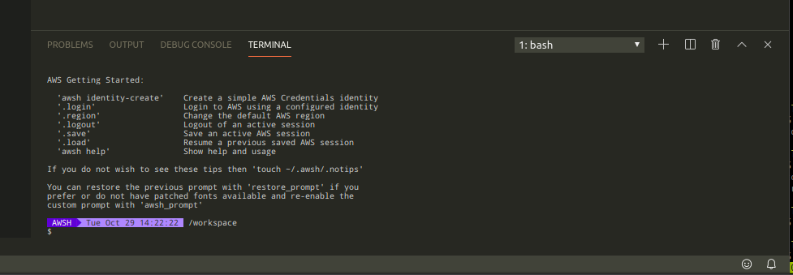
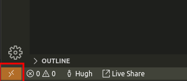

# AWSH: Cloud Shell - VS Code Remote Workspace

AWS Shell: Load and use your AWS identities with all your favorite AWS tools inside VS Code using Remote 

## What is AWSH and how can it help me?

The AWSH tools are a collection of Python and BASH helper scripts that are intended to augment your existing interaction with AWS by;

- Helping with the loading of AWS credentials into the environment that can be re-used by all of your existing AWS toolset; Terraform, AWS CLI, Terraforming, Ansible, etc
- Helping to generate useful information about existing resources you already have on AWS in a format that can be used as part of a pipeline for other tools/apps

## Using AWSH with VS Code Remote

- Clone the repo and open it in VS Code. VS Code will detect the Container configuration and offer to re-open your workspace in a Container

    

- Add your own source code/tools as normal

- You also have AWSH embedded into your default Terminal

    

### Customization

- Modify the contents of `docker-compose.yml` to suit your own preferences and environment (add your own extensions)

    

- If you made changes, when prompted by VS Code select to "Rebuild" the Container

### Manually starting Remote

- You can also start/build the Container by using the "Remote" option (bottom-left) or via the Command Palette

    

    

